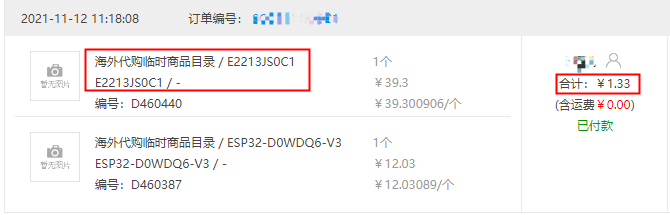
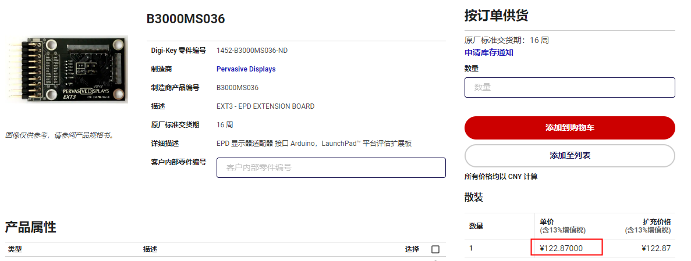
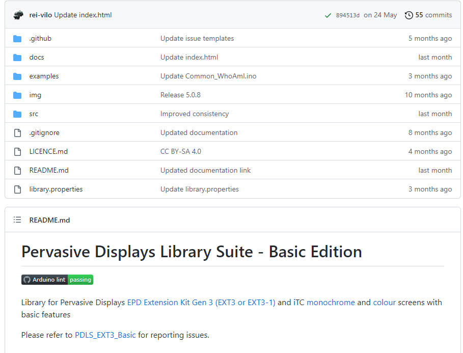
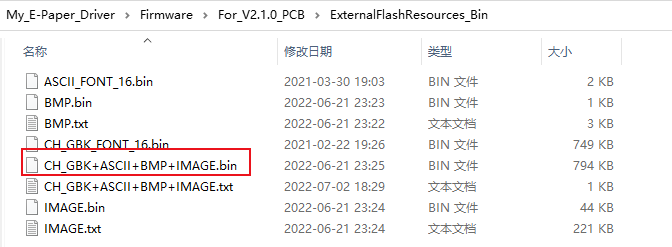
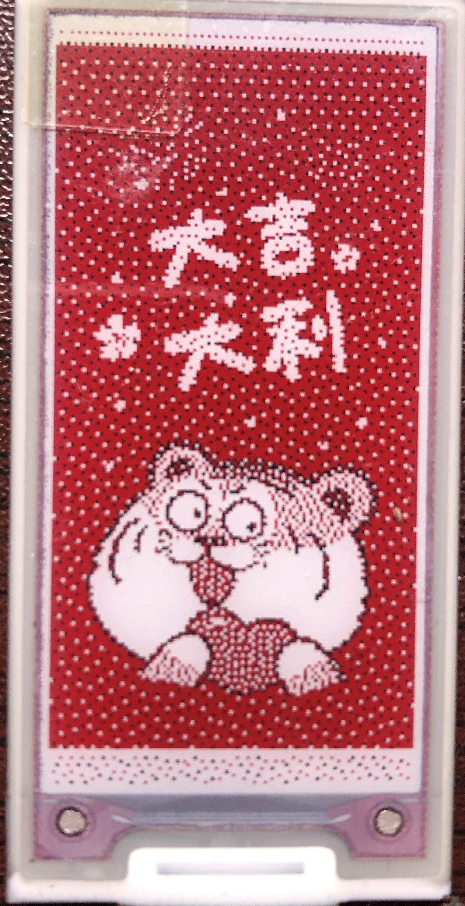
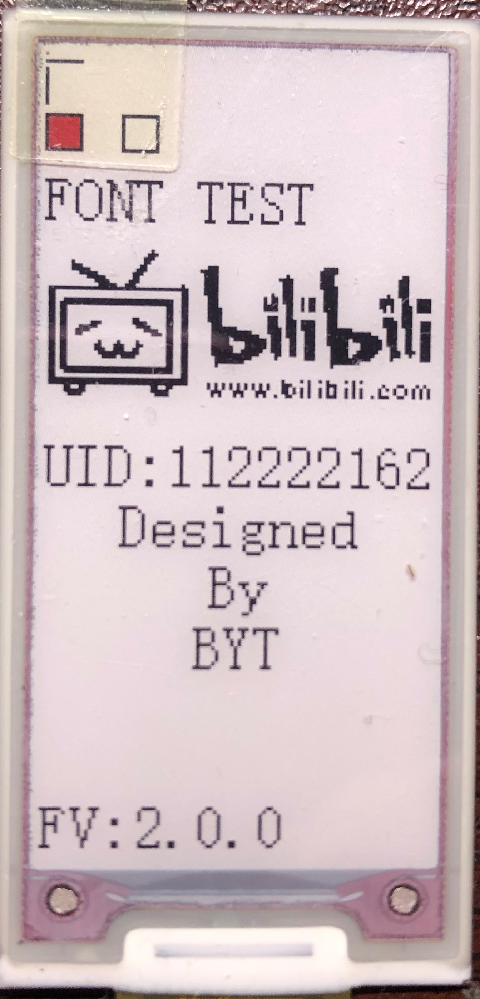
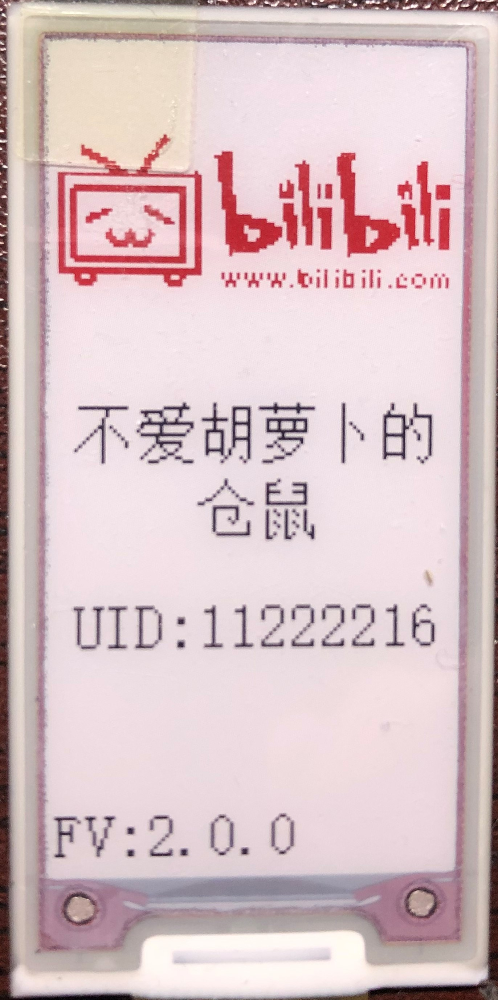
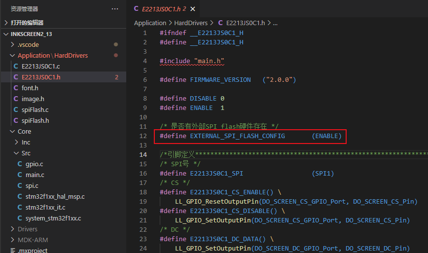
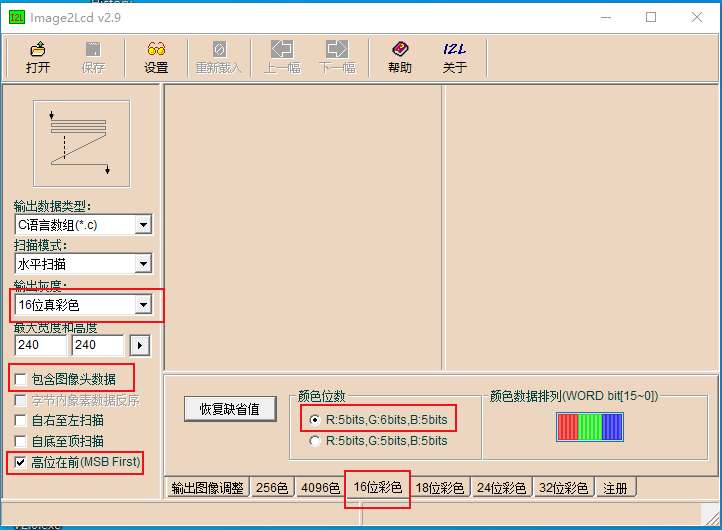

# My_E-Paper_Driver

[TOC]


# 更新说明

## 2022.07.09 

​		更新V2版本的PCB和程序。HW：V2.1.0；FW：V2.0.0

​		PCB在V1的基础上增加一个SPI Flash，用于储存中文字库、ASCII字库、图片等数据。

​		程序以V1为基础，增加了从SPI Flash读取数据显示中文、ASCII字符、BMP图、三色图的相关函数。

# 一.项目起源

​		想不看文字听我讲故事的，可以移步“https://www.bilibili.com/video/BV1aL4y137BQ/?vd_source=b5472a9f9c8c4560fd993637d3d9cb0f”观看视频。

​		这个事儿吧，还得从几个月前立创商城搞活动，弄了海外代购51-50的优惠券，我白嫖了好几块电子墨水屏，型号为“E2213JS0C1”。



​		然后白嫖到手后发现我还需要配套的驱动板，好家伙，只有得捷电子、贸泽电子有卖，价格还这么贵？告辞。



​		随后我又去找驱动程序，发现官网有基于Arduino做的库，我想把它移植出来，使得它可以在包括但不限于STM32的平台上跑，但是它是基于C++的，我太菜了，不会（大哭）。



​		驱动板买不起，驱动程序不会移植，那干脆一不做二不休，自己从零开始做，还好官方的技术文档里有推荐的外围电路和驱动流程。

# 二.项目文件框架说明

​		整个项目中有4个文件夹：Hardware、Firmware、Tool、Readme_Image。下面我会详细解释各个文件夹的作用及其中文件的使用注意点。

## 2.1 Hardware文件夹

​		这里存放的是PCB工程，每个版本的文件夹下有：

①AD的工程文件（名称为“My_E-Paper_Driver_VX.X.X.rar”）。

②直接可以发去PCB厂家打样的Gerber文件（名称为“My_E-Paper_Driver_VX.X.X(Gerber).rar”）。

③导出成PDF的原理图（名称为“My_E-Paper_Driver_VX.X.X.pdf”）。

④更新说明。

### 2.1.1 V1.0.0

​		这是第一版，只有单纯的驱动电路，如果你只需要驱动电子墨水屏，可以使用这个PCB工程。

### 2.1.2 V2.0.0

​		在V1.0.0的基础上增加了一个SPI Flash，用于存放中文字符、ASCII字符、BMP图、三色图数据，并且和电子墨水屏共用一个SPI，但是不知道为什么，程序就是调不出来，暂时放弃，期待一位大佬来看看，所以我依然保留了这一版的PCB工程。这个版本不建议使用。

### 2.1.3 V2.1.0

​		把V2.0.0的SPI Flash的SPI数据线单独拆了出来，让二者各自使用自己的SPI。**这是最新版可用的PCB，建议使用这个版本的PCB。**

## 2.2 Firmware文件夹

​		这里存放的是各个版本的驱动程序。每个版本的文件夹下有：

①“InkScreen2_13”文件夹中是Keil工程文件。

②“Release_HEX”文件夹中存放了编译好的烧录到STM32上的HEX文件，可以直接烧录，不需要打开keil编译，可以用于焊接好硬件后的首次验证。

③“ExternalFlashresources_Bin”文件夹中存放了需要烧录到外置Flash中所需要的资源文件（这个只有在For_V2.1.0_PCB中有）。

### 2.2.1 For_V1.0.0_PCB

​		可以在“V1.0.0”、“V2.1.0”的PCB上跑（“V2.1.0”只要不接SPI Flash的数据线就好），但是**请不要再使用这个工程**。因为**本工程不再维护**，会缺少一些新功能，也不修复BUG，你可以使用新的“For_V2.1.0_PCB”工程，它可以兼容老的板子。

### 2.2.2 For_V2.1.0_PCB

​		可以在“V1.0.0”、“V2.1.0”的PCB上跑，默认是在“V2.1.0”的PCB上跑的，如果你手上有“V1.0.0”的PCB，可以通过配置宏定义来关闭SPI Flash相关的代码，实现向下兼容，这点可以见“[四.V2版的程序如何兼容V1.0.0的PCB](#四.V2版的程序如何兼容V1.0.0的PCB)”

​		还有一点需要注意的是，由于每修改工程配置/编译一次，Drivers、MDK-ARM这两个文件夹就会产生很多新的文件/改变文件，但是这些文件不需要被Git管理，所以我把他们ignore了，我会在将开发分支合并到master分支前的最后一次提交时，把他们打进压缩包里，你到手使用时需要解压出来。

## 2.3 Tool文件夹

​		这里存放的是本项目会使用到的一些工具。

## 2.4 Readme_Image文件夹

​		readme所需要用的图片文件，无需关注。

# 三.如何跑Demo

​		这里以V2.1.0版PCB、For_V2.1.0_PCB中的驱动程序（FW：2.0.0）为例。

## 3.1 硬件准备

①STM32F103C8T6最小系统板

②杜邦线若干（请务必注意杜邦线的长度，尽可能的短，并且注意杜邦线的质量，现在网购的杜邦线太便宜的品质都不太妙）

③电子墨水屏，型号为“E2213JS0C1”

④驱动板

⑤MicorUSB供电线

⑥烧录器（J-link、ST-Link、串口等均可）

## 3.2 接线

驱动板						单片机

GND				  ---->	GND

3.3V				   ---->	3.3V

MOSI				 ---->	PA7

CS					  ---->	PA4

RST					---->	PA3

CLK					---->	PA5

DC					 ---->	PA2

BUSY				 ---->	PA1

FLASH_MISO	---->	PB14

FLASH_CS		 ---->	PB12

FLASH_MOSI	---->	PB15

FLASH_CLK	   ----->	PB13

## 3.3 烧录

### 3.3.1 STM32的烧录

​		这部分略，可以使用你习惯的烧录方式烧录程序（J-Link、ST-Link、串口等都行），HEX文件在“Firmware”-“For_V2.1.0_PCB”-“Release_HEX”中(如果你愿意打开Keil自己编译烧录也行)

### 3.3.2 外置Flash的烧录

​		外置Flash的烧录也有很多方案，但是目前也没有找到又便宜又方便的方案（毕竟还要考虑后续移植到别的平台）。可以看一下我的视频，里面是我的解决方案“https://www.bilibili.com/video/BV1Du411r7ow/?vd_source=b5472a9f9c8c4560fd993637d3d9cb0f”，但是这个方法只能说是在我用手上的资源最快能实现我要求的方案，但是它的局限性太多了。

​		外置Flash烧录所需的bin文件路径为“Firmware”->"For_V2.1.0_PCB"->"ExternalFlashresources_Bin"->"CH_GBK+ASCII+BMP+IMAGE.bin"。



## 3.4 效果

​		上电后屏幕会刷新4次，每次刷新完成后会停留3S。

​		第一次调用显示三色图的函数，图片数据来源为片内Flash。



​		第二次调用画点、画线、画矩形、显示ASCII字符（串）、显示BMP图片的函数，BMP图片数据来源为片内Flash。



​		第三次调用显示三色图的函数，图片数据来源为片外Flash。


​		第四次调用显示BMP图片、显示中文字符、显示ASCII字符（串）的函数，BMP图片数据、中文字符数据、ASCII字符数来源均为片外Flash。



# 四.V2版的程序如何兼容V1.0.0的PCB

​		因为“For_V1.0.0_PCB”中的程序不再维护，这意味着新的功能、BUG修复也不再会有了，那么如果你手上有V1.0.0的PCB或者你就只想用V1.0.0的PCB，你可以通过修改程序，来屏蔽掉与SPI Flash有关的代码。

​		修改方法很简单，打开“For_V2.1.0_PCB”-“InkScreen2_13”-“Application”-“HardDrivers”-“E2213JS0C1.h”，在文件的最开始有一个名字叫“EXTERNAL_SPI_FLASH_CONFIG”的宏定义，把他从“ENABLE”改成“DISABLE”，然后重新编译工程即可。



# 五.如何添加自定义的字库、图片？

​		Demo片内Flash默认自带一张三色图、一张BMP图、ASCII字库（8X16像素）。

​		Demo外部Flashg默认自带一张三色图、一张BMP图、ASCII字库（8X16像素）、中文字库（GBK编码，16X16像素）。

​		但是默认自带的肯定不能满足大家的需求，所以我会在这一章节讲述如何添加自定义的字库、图片。

## 5.1 如何添加自定义ASCII字库到片内Flash

​		如何制作ASCII字符字库懒得打字了，请移步“https://www.bilibili.com/video/BV1jZ4y1e7y3/?vd_source=b5472a9f9c8c4560fd993637d3d9cb0f”观看视频。所需软件在“Tool”->"PCtoLCD2002完美版"中。

​		取模好的数据我们需要保存到“font.h”中，格式如下所示

```c
const unsigned char AAA[95][BBB] = {
    CCC
};
```

AAA表示数组名称，可自定义，推荐命名方法ASCII_XXXX。

BBB表示单个ASCII字符取模结果字节数，例如8*16的ASCII一个字符取模结果就是16字节。

CCC表示取模结果，把取模结果粘贴到此处。

​		然后在"E2213JS0C1.h"中100行的“字库”下方行添加对应的宏定义，定义格式可以参考在那边写的1608。

例如你添加的字库是3216的

```c
#define FONT_3216		    (1)
#define FONT_3216_WIDTH		(16)
#define FONT_3216_HEIGHT	(32)
```

​		下一步你需要完成“E2213JS0C1_ShowChar”这个函数，因为在这个函数中我使用了switch，你需要完成对应的case。

## 5.2 如何添加自定义BMP图到片内Flash

​		如何将图片转成BMP并取模懒得打字了，请移步“https://www.bilibili.com/video/BV1bB4y1W7c3/?vd_source=b5472a9f9c8c4560fd993637d3d9cb0f”观看视频。所需软件在“Tool”->"PCtoLCD2002完美版"中。

​		取模好的数据我们需要保存到“image.h”中，格式如下所示

```c
const unsigned char AAA[BBB] = {
    CCC
};
```

AAA表示数组名称，可自定义。

BBB表示取模结果的总字数。

CCC表示取模结果，把取模结果粘贴到此处。

​		BMP图片不需要做其他操作，如果你愿意，可以在"E2213JS0C1.h"中找个地方做一下BMP图片宽高的宏定义。

## 5.3 如何添加自定义三色图到片内Flash

​		这里需要注意的是，因为这个墨水屏只能显示黑白红三色，所以在选取图片是尽量选择接近这三个颜色的，不然显示出来很丑。

​		首先我们需要把普通图片转成三色图，因为普通的图片不是绝对的黑白红三色的，如何转换可以看一下这个教程“https://www.waveshare.net/wiki/E-Paper-Floyd-Steinberg”

​		然后我们打开“Tool”->“Image2Lcd 2.9(破解版)”->“Img2Lcd.exe”，参数设置如下图所示：



点击左上角的“打开”，选择你要取模的图片，然后再点击“保存”，选择路径和文件名，.c或.h格式都行，之后会自动动记事本打开文件，里面是一个数组，将数组整个复制出来，后续操作就和“[5.2 如何添加自定义BMP图到片内Flash](#5.2 如何添加自定义BMP图到片内Flash)”一样

## 5.4 如何制作中文字库

​		如何制作中文字库懒得打字了，请移步“https://www.bilibili.com/video/BV1QW4y167AV/?vd_source=b5472a9f9c8c4560fd993637d3d9cb0f”观看视频。所需的工具在“Tool”->"字库制作软件"。

​		制作好的中文字库bin文件如何放到外部Flash，会在“[5.7 如何添加中文字库、ASCII字库、BMP图、三色图到片外Flash](#5.7 如何添加中文字库、ASCII字库、BMP图、三色图到片外Flash)”中讲解

## 5.5 如何将ASCII字库、 BMP图、三色图数据转成bin文件

​		我们之前取模时，最终结果都是变成一个数组，这里我会讲解如何把数组转换成一个bin文件。需要用到的工具就是“C2B V2.0.exe”，在“Tool”->"C2B V2.0"。

​	首先我们需要把数组复制出来，新建一个.txt/.c/.h文件，将一个数组放进去。然后我们打开“C2B V2.0.exe”这个软件，其中参数都选择默认，即“小端模式”、“16位”。然后点击“打开文件”，选择刚才新建的.txt/.c/.h文件，再点“转换”，即可在.txt/.c/.h文件路径下找到生成的.bin文件。

## 5.6 如何把多个bin文件合并成一个bin文件

​		至此我们已经完成了GBK中文字库、ASCII字符字库的取模、BMP图取模、三色图取模，最终产生了四个bin文件，这里我会讲解如何将这四个bin文件合并成一个bin文件，然后在“[5.7 如何添加中文字库、ASCII字库、BMP图、三色图到片外Flash](#5.7 如何添加中文字库、ASCII字库、BMP图、三色图到片外Flash)”中烧录使用。

​		！需要注意的是，这一步并不是必要的，你也可以一个一个bin文件单独烧录，效果也是一样的，就是麻烦。

​		这里我们要用到的是“二进制文件合并工具.exe”，在“Tool”->"UBIN"中。

​		首先需要点击“目标文件”右边的“浏览”


选择一个路径、填写文件名，这一步是用于设置合并好的bin文件名称和保存路径。

​		然后我们来添加需要被合并的bin文件，点击“源文件”右边的“浏览”选择需要被合并的bin文件，然后“偏移量”默认0x00000000，再点击“添加”，就可以在上面看到本次添加的bin文件。


​		然后重复上述步骤，添加其他的bin文件。所有的bin文件添加好后，点击“合并”。就可以在之前设置的路径中找到合并好的bin文件，以及一个txt文件，里面记录了合并的相关信息。

​		！上述操作是把所有bin文件首尾相连，像排队那样的合并起来。每个bin文件的起始地址就是上一个bin文件结束地址+1。如果你想让每个bin文件有自定义的起始地址（例如第一个bin文件起始地址0x00000000，第二个起始地址0x10000000，第三个......），可以研究一下“偏移量”和“插入”的使用，这里我就不赘述了。

## 5.7 如何添加中文字库、ASCII字库、BMP图、三色图到片外Flash

​		这边有两个步骤：

①：将合并好的bin文件烧录到外部Flash，可以看“[3.3.2 外置Flash的烧录](#3.3.2 外置Flash的烧录)”。

②：程序中的适配，这也是我这边要进行讲解的。

​		我们需要用到“[5.6 如何把多个bin文件合并成一个bin文件](#5.6 如何把多个bin文件合并成一个bin文件)”中生成的txt文件，这里有我们需要的各个资源的起始地址。

​		我们需要修改"E2213JS0C1.h"，在如图下图中106-128行区域中添加新的资源的相关参数。

​		下图是如何使用txt文件中的数据的示例，如果你的各个资源不是连续的，是自定义起始地址的，就可用这个txt文件。


​		如果你新增了BMP图或三色图，只需要添加首地址、图片的长宽像素数即可，可以参照图中120-122或124-126的格式。

​		如果你增加的是中文字库和ASCII字库（强烈建议同一尺寸的中文字库和ASCII字符同时取模，配套使用）。你需要在107行的枚举中增加新的枚举。并且添加中文字库和ASCII字符的首地址、单个字符取模结果的字节数、宽度/高度像素数。随后你需要在E2213JS0C1_ShowGBKFontOrAsciiFromFlash这个函数中的switch下增加新字库的相关参数。

# 六.后续更新的想法

​		1.实现屏幕显示方向的设置，因为屏幕没有办法直接设置显示方向，这个只能由驱动程序来做。

​		2.使用中文字库时还需要手动在数组中输入GBK编码，太麻烦，后续看看能不能加入UTF-8编码转GBK编码。这样就可以直接在Keil中输入中文了。

# 七.Q&A

​		因为文档总有写的不详细的地方，大家在使用时遇到问题，我会把经典的问题和解答放在这里。

# 八.絮絮叨叨

​		首先我得吐槽一下这个破屏幕，我现在的想法就是一个字，后悔（大哭）。当时白嫖时看双色和三色屏幕价格差不多，加量不加价，那我肯定买三色啊，妹想到哇，这破玩意儿只能全刷，不能局刷。本来还想拿来做个桌面小闹钟啥的，这下好了，直接反向升级，只能做日历了。

​		另外我这写代码的能力也不咋地，如果有看不懂的地方，或者发现了BUG，或者你有什么新的想法希望我实现的，欢迎在B站给我留私信，不出意外的话我会在当天回复。

​		最后非常感谢大家使用我设计的PCB和驱动程序，距离V1发布到现在已经过去好几个月了，理论上我应该很快就完成V2的，但是我太懒了，所以欢迎催更。